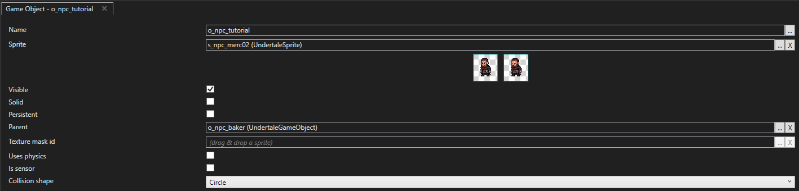
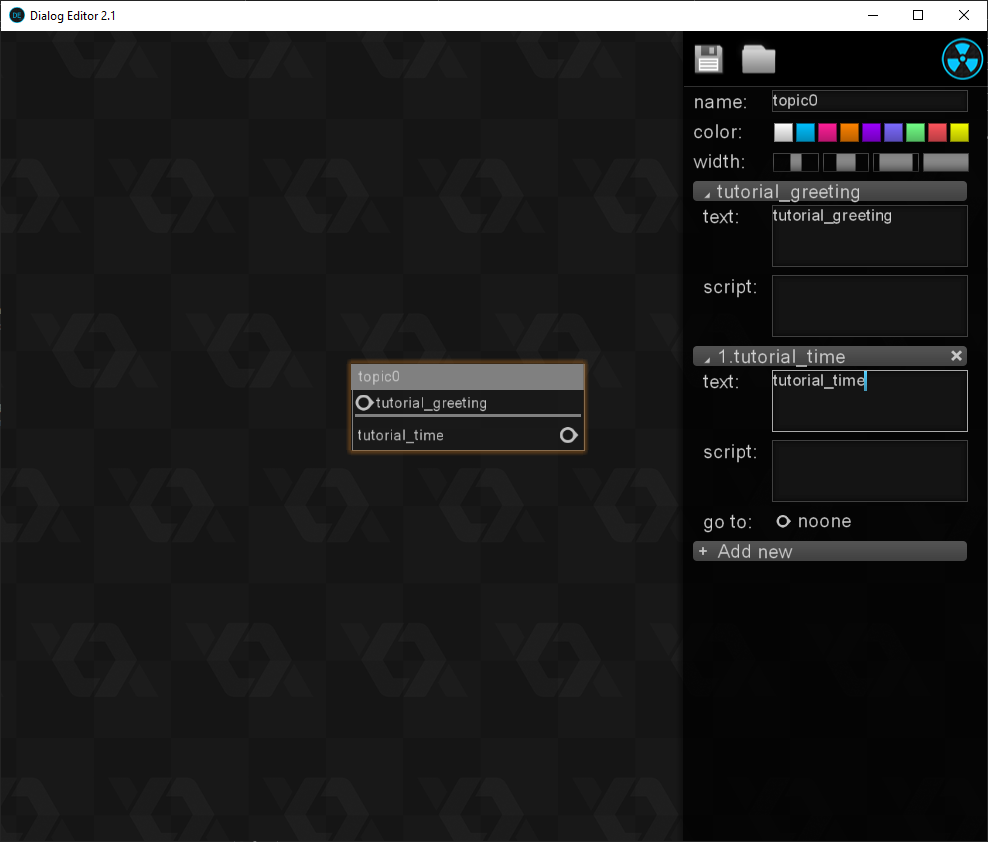
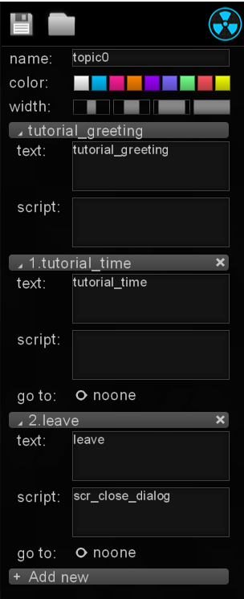
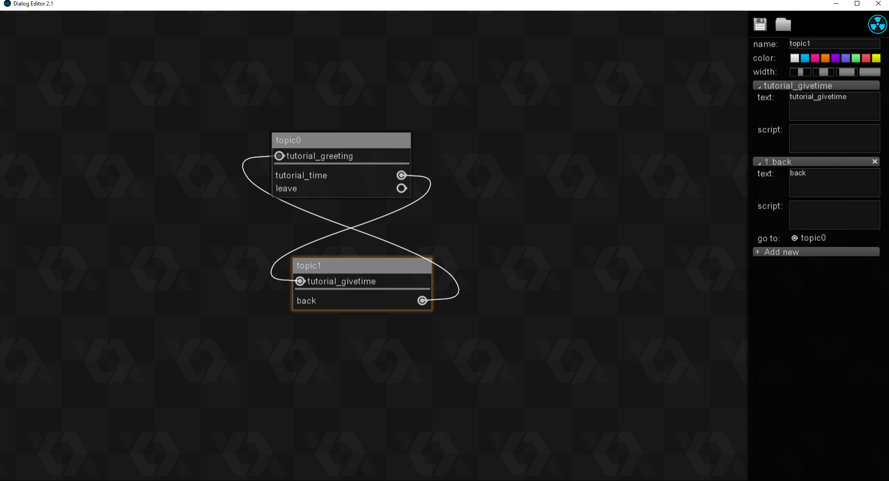
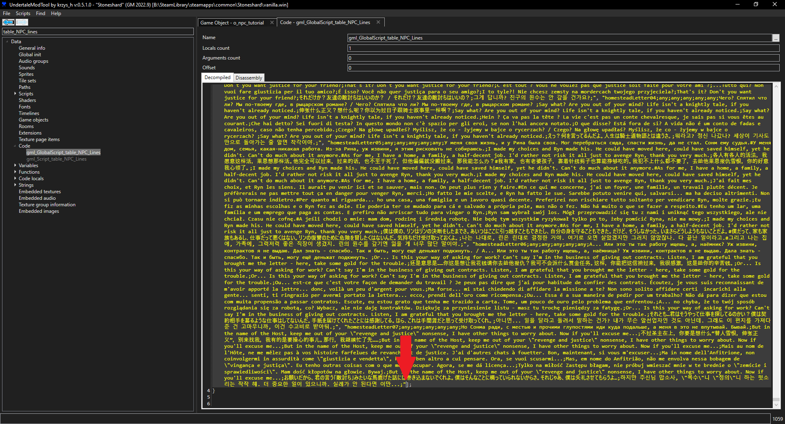

# Adding Basic Dialogue

:octicons-tag-24: **0.8.1.11**

## Description
This guide's objective is to add a **simple dialogue** with the **DE2 system**.  
We will **add dialogue** to a **newly created NPC** to demonstrate the **basic usage** of the **Dialogue Editor 2 Tool**.

---

## Creating the NPC
To add **dialogue**, we're going to need an **NPC** capable of speech.  
Let's implement one.

??? abstract "1. Creating the gameobject"
    - Create a new **gameobject** and name it `o_npc_tutorial`.
    - Add `o_npc_baker` as its **parent**.
    - Add any of the `s_npc_...` **sprite** to it. (*I'll add the `s_npc_merc02` for this tutorial.*)

    

??? abstract "2. Adding the Create Event"
    If we don't change anything, our **new NPC** will be a **baker** and have the **baker's dialogues**.  
    Not quite what we want, so let's **change that** by adding a **Create Event** to **override** the **baker's** :
    ```py title="o_npc_tutorial - Create Event" linenums="1"
    event_inherited()  
    name = "Something Original" #(1)!
    id_name = "tutorial"  #(2)!
    occupation = "tutorial" #(3)!
    subtype = "townee"  
    ds_list_clear(myfloor_list)  
    ds_list_add(myfloor_list, "S1", "S1", "S1", "S1")  
    delta_array = ["S1", "S1", "S1", "S1"]  
    myfloor = "S1"  
    myfloor_counter = "S1"  
    scr_set_hl()
    time_period_night = do_animation  
    ai_script = gml_Script_scr_enemy_choose_state
    idle_state = 0
    rumors = 0 #(4)!
    chat = 1 #(5)!
    dialog_id = de2_dialog_open("tutorial.de2") #(6)!
    topic = "topic0" #(7)!
    gold_k = irandom_range(100, 300) #(8)!
    ```

    1. Obviously, this is the **name** for your NPC.</br>There are **other ways** to set it but this will do.
    2. The unique identifier for this NPC.</br>I usually keep it the same as the occupation.</br>Not exactly sure where it's used yet.
    3. The **job** of your NPC.</br>All NPC's have a **job**.</br>This can be **baker**, **drunkard** or anything you can imagine.</br></br>It's used to **filter out dialogues** of the **same name**.</br>For instance, there may be **several** `greeting` **dialogues** in the game, but **only 1** for the **occupation** you specified, and so this is the one that will be used.
    4. Whether this NPC is able to **share rumors** with the player or not.
    5. Whether this NPC can **chat with the player** or not.
    6. The **.de2 dialogue file** to open to find the **dialogue's structure**.
    7. The **topic** to start the provided **dialogue** at.</br>This will **make more sense in a moment**.
    8. The **amount of gold** the NPC should have on him.</br>Here, a **random amount** between 100 and 300.

??? abstract "3. Adding the Alarm 1 Event"
    The **Alarm 1 Event** is where we're going to **load our dialogues into the game**.  
    Obviously, we haven't **created them yet**, but bare with me, we're **getting there**.

    ```py title="o_npc_tutorial - Alarm 1 Event" linenums="1"
    event_inherited()  
    scr_npc_list_add_dialog(questions_map, "tutorial_greeting", "map")  
    scr_npc_list_add_dialog(questions_map, "tutorial_time", "map")  
    scr_npc_list_add_dialog(questions_map, "tutorial_givetime", "map")  
    ```

---

## Creating the Dialogue Structure
Now that we have an **NPC** set up, let's **prepare our dialogue**.
??? abstract "1. Create a new topic"
    - Open `DE2.exe`.  
    - **Right click** anywhere on the **canvas** to create a **new topic**.
    - You can **rename** it if you want to, but you will need to **reflect that change** in `o_npc_tutorial` **Create Event**.

??? abstract "2. Adding lines"
    Now you could just **write dialogue** by simply **writing anything** in the `Text` field, and **that would work**.  
    But that's simply ^^**not the best way to do things**^^.

    ??? question "But why ?"
        Because if you want to **reuse the same line** somewhere else in your dialogue, or even in **another dialogue**, you will have to **rewrite it entirely**.  
        Instead, we usually put the **dialogue line's ID** in the `Text` field, and **let Stoneshard find the appropriate text**.

    ---

    For now let's **write down** `tutorial_greeting` in the `Text` **field**.  
    We can leave the **script field empty** as we don't want to **run any specific function** for this.

??? abstract "3. Adding answers"
    Having an **NPC say a line** is fine and dandy, but wouldn't it be nice to have **answers** to **leave**, **trade** or say **anything you may come up with** ?  
    This can be achieved **fairly easily** : 

    - Click the `Add new` button with a topic selected. 
    - Specify the dialogue line ID for your answer (or type your answer here directly)
    - For our tutorial we will use `tutorial_time`.

    ---

    Much like you can add your **own dialogue lines**, Stoneshard has some **useful lines** you can freely use.  
    Here's a **list** of some of them :
    ??? note "Useful Dialogue Lines List"
        - trade
        - back
        - leave
        - return
        - rent_room
        - work
        - chat
        - this_place
        - agree
        - advance
        - think
        - continue
        - dungeon_complete
        - bounty_complete

    ---

    Additionally, some **specific answers** may require **scripts** to provide the **expected result**, like **trading** or **closing the dialogue**.  
    That's why we have the **script field** !

    Here's a **non exhaustive** list of useful **functions** to call there :
    ??? note "Useful Scripts List"
        - scr_close_dialog
        - scr_trade_open
        - your own functions !

??? note "Screenshot - Dialog Editor"
    If you've followed the guide to this point this is what you should be looking at in your Dialog Editor :

    

??? abstract "4. Adding a way to close the dialog"
    Once again hit the `Add new` button and write the following :

    

    When this answer will be clicked, the script `scr_close_dialog` will be called.  
    You can probably guess what it does.

??? abstract "5. Adding another Topic"
    Right click anywhere on the canvas to add a new topic.  
    Once again you can **rename** it to anything, but this time **no need to change anything** in the `o_npc_tutorial` **Create Event** as this won't be our **starting topic**.

    - In the `Text` field, write `tutorial_givetime`.
    - **Drag the node** from the `tutorial_time` **answer** to our **new topic**.
    - Add a new answer by clicking the `Add new` button.
    - In the **answer's** `Text` field, write `back`.
    - Drag the **node** from the `back` **answer** to the **first topic** we created before.
    ??? note "Screenshot - New Topic"
        
    
??? abstract "6. Saving"
    Now that we're happy with our dialogue, we can save our **.de2 file**.  
    Click the **floppy disk** on the top right or use the usual ++control+alt+s++ **shortcut** to **save**.
    
    ---

    Make sure to save your **.de2 file** in the `dialogs` folder inside your **game installation directory**.  
    There should already be **plenty** of other **.de2 files** there.

    ---

    Also make sure to name your **.de2 file** the exact same way you wrote it in the `o_npc_tutorial` **Create Event**, otherwise the game **won't find it**.

---

## Adding the Dialogue Lines

Okay. We're done with the set up. We have a **working NPC** and we also created our **dialogue structure**.  
Now onto the **dialogue lines** themselves.

??? abstract "1. Listing dialogue line ID's"
    When we were creating our **dialogue structure**, we wrote **placeholder dialogue id's**.  
    Let's list them here for reference :
    
    - tutorial_greeting
    - tutorial_time
    - tutorial_givetime
    - leave
    - back

    As mentionned previously, `leave` and `back` are built in Stoneshard, so we already know those will be **replaced with the proper text when the game is run**.  
    But the rest of our **dialogues** are **custom** and don't already exists.  
    Let's create those.

??? abstract "2. Registering dialogues in table_NPC_Lines"
    Working with tables in UMT can be **difficult** at times.  
    The `table_NPC_Lines` **table** is definitely one of if not the **worst offenders** in that regard.  
    It's over **^^3 millions characters long^^** and it **WILL** lag the fuck out of your UMT.

    When working with those, you can **extract them** with the [GML to CSV Converter](../tools/gmltocsv.md) or you can **do it by hand**.  
    I recommend **extracting it** so you can **figure out** what each **field** does.  
    But I feel lazy so let's simply do it by hand this time :

    ```
    , "tutorial_greeting;any;tutorial;any;any;any;This is a tutorial.;This is a tutorial.;This is a tutorial.;This is a tutorial.;This is a tutorial.;This is a tutorial.;This is a tutorial.;This is a tutorial.;This is a tutorial.;This is a tutorial.;This is a tutorial.;This is a tutorial.;This is a tutorial.;This is a tutorial.;", "tutorial_time;any;tutorial;any;any;any;Ask for the time.;Ask for the time.;Ask for the time.;Ask for the time.;Ask for the time.;Ask for the time.;Ask for the time.;Ask for the time.;Ask for the time.;Ask for the time.;Ask for the time.;Ask for the time.;Ask for the time.;Ask for the time.;", "tutorial_givetime;any;tutorial;any;any;any;Huh ? The time ? I have no idea.;Huh ? The time ? I have no idea.;Huh ? The time ? I have no idea.;Huh ? The time ? I have no idea.;Huh ? The time ? I have no idea.;Huh ? The time ? I have no idea.;Huh ? The time ? I have no idea.;Huh ? The time ? I have no idea.;Huh ? The time ? I have no idea.;Huh ? The time ? I have no idea.;Huh ? The time ? I have no idea.;Huh ? The time ? I have no idea.;Huh ? The time ? I have no idea.;Huh ? The time ? I have no idea.;"
    ```
    
    ---

    Simply **copy this block** here :

    


---

## Testing

Now it's time to **test our dialogue**.  
Add our **NPC** to **any room** or **spawn it** by pressing ++f1++ with the **following script** :

```py title="o_player - gml_Object_o_player_KeyPress_112" linenums="1"

instance_create_depth(x, y, depth, o_npc_tutorial);
```
