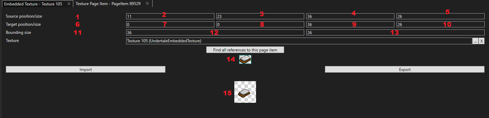

# Adding New Sprites

!!! Warning
    This article is planned to be rewritten soon. Stay tuned.

In Stoneshard, sprites aren't simply imported as png files, but as spritesheets in an "**Embedded Texture**" which is then cut into multiple "**Page Items**", and turned into actual "**Sprites**".

---

### Embedded Textures :

That's the entry point for textures. Each mod should create a new one (or several) with their whole spritesheet. They need to be in power of 2's dimensions, so for instance :

`16, 32, 64, 128, 256, 512...`

A valid resolution for an embedded texture could be `512x128`.

### Page Items :

Page Items crop Embedded Textures and isolate the desired sprites.
In the end, you can have as many Page Items as you had sprites on your Embedded Texture.

### Sprites :

The actual Sprite itself is created, and takes one or multiple Page Item as a texture.
It can then be named and used by gameobjects.

---

## Manually Importing Sprites:

- `1` This line is the one corresponding to #15, aka your base texture file. It's essentially an invisible box controlled by #2, #3, #4 and #5. If it's on your texture, it will show with colors and not transparent.
- `2` This is the offset on the X axis for your invisible box. (from the left side)
- `3` This is the offset on the Y axis for your invisible box. (from the top)
- `4` This is the length on the X axis for your invisible box.
- `5` This is the height on the Y axis for your invisible box.
- `6` This line is the one which corresponds to #14, aka the Page Item you're trying to create. it's a visible green box on a transparent background where your sprite should appear.
- `7` This is the offset on the X axis for your green box. IT IS BASED ON #11's SIZE.
- `8` This is the offset on the Y axus for your green box. IT IS BASED ON #11's SIZE.
- `9` This is the length on the X axis for your green box.
- `10` This is the height on the Y axis for your green box.
- `11` This line defines the bounding box, aka the size of the transparent background on which your green box sits.
- `12` This is the length on the X axis for the bounding box.
- `13` This is the height on the Y axis for the bounding box.
- `14` This is your Page Item. Your cropped texture should appear here inside a green box.
- `15` This is your Embedded Texture, which can contain many different sprites. It should be displayed with colors and not transparent.

### Notes :

- UMT is **VERY buggy** and the Page Item **sometimes doesn't update even if you're perfectly on your sprite**, just in case it wasn't hard enough to understand what the fuck is going on.
- If you're creating an item that is supposed to fit in your inventory, **a single cell is** `27x27`, anything bigger than that will **overflow** into other cells.
- It's good to check other inventory items of the same size as the one you want to create to check for their **sprite's dimensions**.

## Automatically Importing Sprites

To automatically import sprites, you need to use UMT's Scripts :  
`UMT > Scripts > Resource Repackers > Import Graphics.csx`

The sprites need to be in a folder named 'Sprites', with their name respecting the following format : `s_objectname_0.png`  
The number at the end can be used when multiple sprites have the same name, like in animations.
