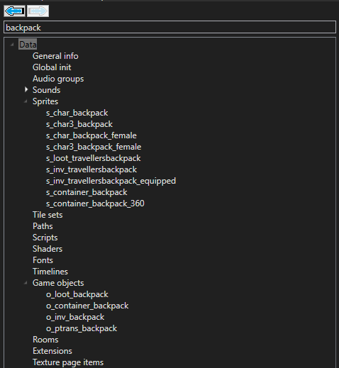
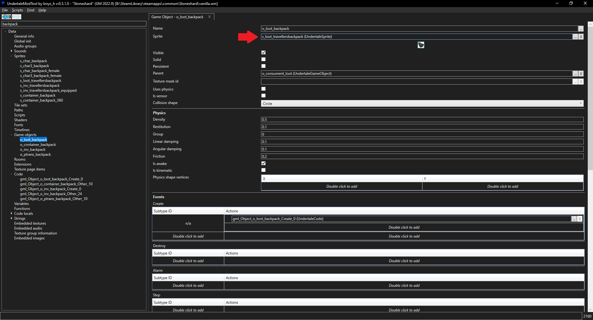
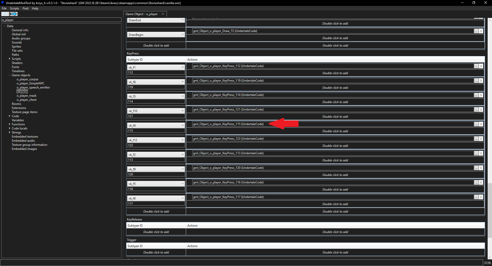
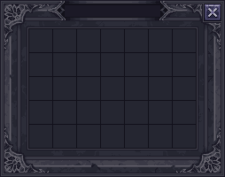

# Bigger Backpacks

:octicons-tag-24: **0.8.1.9**

!!! Info
    This guide was initially written by [DrStalker](https://www.reddit.com/user/DrStalker/) on [Reddit :fontawesome-brands-square-reddit:]((https://www.reddit.com/r/stoneshard/comments/11zbxgy/a_simple_guide_to_modding_stoneshard_with_an/)) and rewritten to fit this documentation's format.  

    This guide assumes you're familiar with the basics of modding Stoneshard.  
    If that's not the case, try reading the [Getting Started](./getting-started.md) guide first.

## Description

In this article we're going to take the very limited backpacks of the game and make them a bit more convenient to use, first by changing their size in the inventory and then by changing their capacity.

This guide is a bit more advanced than the example in [Getting Started](./getting-started.md), so make sure to read thoroughly.

---

## Identifying the assets
Since we're working with a **gameobject**, we need to identify the **assets related** to backpacks and figure out what they do.  
??? abstract "1. Identifying the backpack gameobjects"
    
    ??? note "Screenshot - Search for `backpack`"
         
    As seen in the screenshot above, when searching for `backpack` in UMT, we get a few gameobjects :

    - **o_loot_backpack**, this is the the backpack when ==on the ground==. 
    - **o_inv_backpack**, this is the backpack when ==in your inventory==.
    - **o_container_backpack**, this is the ==GUI== that shows up ==when you open the backpack==.

??? abstract "2. Identifying the backpack sprites"
    When we searched `backpack` in UMT, we also seem to have found a few sprites.  
    But how do we know which ones are of interest to us ?

    **Double click** on the gameobjects we've identified above and simply check their `Sprite` field !
    ??? note "Screenshot - Finding the Sprites"
        
    Now we know which sprite is used by the gameobjects we found :

    - o_loot_backpack -> `s_loot_travellersbackpack`
    - o_inv_backpack -> `s_inv_travellersbackpack`
    - o_container_backpack -> `s_container_backpack`

--- 
## Changing the size in the inventory

Now that we know what **gameobjects** and **sprites** to look at, we can get to work.  
Since we're trying to modify the backpack **in the inventory**, we know that there is a good chance we will have to modify `o_inv_backpack`, `s_inv_travellersbackpack` or both.

??? abstract "Quick Theory - Inventory Cell Size"
    As we are going to deal with an inventory sprite (`s_inv_*...`), there's a very important thing to know.

    Each **cell** in your inventory is exactly ==**27x27 pixels**==.  
    !!! question "But why is that important ?"
        Because **Stoneshard doesn't set a value for how many cells an item is going to take in your inventory anywhere**.  
        The game decides this solely based on the **size** of your sprite.
    
    Here are some **good** examples :

    - :white_check_mark: A sprite which is `27x27` pixels will be `1 cell wide` and `1 cell tall`. (*Example* : `s_inv_coal`)
    - :white_check_mark: A sprite which is `54x27` pixels will be `2 cells wide` and `1 cell tall`. (*Example* : `s_inv_clay_plate`)
    - :white_check_mark: A sprite which is `27x81` pixels will be `1 cell wide` and `3 cells tall`. (*Example* : `s_inv_footmanaxe`)

    Here is a **bad** example :

    - :x: A sprite which is `33x27` pixels will **not fit in a single cell and overflow on its neighbour** horizontally, but fit perfectly vertically.

    ---

    !!! Info
        In short, just make sure your **inventory sprite** is always a **multiple of 27**.  
        If it's not, don't panic, you can always **add padding** to it to make it a **multiple of 27**.

??? abstract "Changing the Size - Part 1"
    Let's take a quick look at `s_inv_travellersbackpack`.

    Its dimensions seem to be `81x108` pixels.  
    As we know a single cell is `27` pixels, we can deduce the resulting item will take `3x4` cells in the inventory.  

    !!! Question "Notice something weird about the sprite itself ?"
    If you answered something like :
    !!! quote "Wait isn't there a lot of padding ?"
    You'd be **correct**.  
    <sub>*If you didn't, it's fine, I swear, I'm not crying you are.*</sub>

    As a matter of fact, if you export the sprite by pressing the `Export all frames (or Spine data if this is a Spine sprite)` button, you'll notice the sprite itself is actually...

    `47x75` **pixels** !

    !!! question "But wait those are not **multiples of 27** !"

    That's absolutely **correct**, but it's close !  
    If we were to try to use **multiples of 27** to make it fit in the inventory cells, the closest we could get would be `54x81` **pixels**, which would mean `2x3` **cells** in the inventory, so let's try to go for that.

    The reason why the sprite itself not using **multiples of 27** is fine is because it's using **padding** to reach them !  
    In the **next section** we'll see how to **get rid of some of that padding** to get our desired `54x81` pixels sprite.

??? abstract "Changing the Size - Part 2"
    First let's change the size of `s_inv_travellersbackpack` to `54x81`.  
    We'll also reduce the margins to `1`, `53`, `80` and `1`.
    ??? note "Screenshot - Editing Size and Margins in `s_inv_travellersbackpack`"
        

    ---

    Now let's **middle mouse click** on `PageItem 2333 (UndertaleTexturePageItem)`.  
    (Alternatively, you can also **double click** it or even **click** the `...` **button** on the right.)

    Once on the **PageItem** for the backpack, let's change the **position** and **bounding box** size for the backpack to those in the screenshot below :
    ??? note "Screenshot - Editing Position and Bounding Box in `PageItem 2333`"
        
    ???+ question "Wait, what did we just do ?"
        I won't go into too much detail here but essentially :

        - We changed the **size** and **margins (padding)** of the **sprite** in `s_inv_travellersbackpack`.
        - Then we changed the **size** and **position** of the **texture** the sprite uses in `PageItem 2333`.
    
    Now that this is done, let's **save our .win file**.

    ---

    !!! Info
        If you already have a backpack you can **load up your save** and **test your changes**.  
        You might need to **move the backpack in your inventory** or **drop it on the ground** and **pick it up** for the change to take effect, as it was saved using the **original size** and not the **new one**.


---
## Spawning the backpack

Having a nice backpack that fits into a `2x3` space in your inventory is fine, but **what if you don't have a backpack in your save** ?  
How do you **test your changes** ?

By **spawning one** out of thin air, *obviously*.  

??? abstract "Spawning the backpack"
    If you've read the [Getting Started](./getting-started.md) article, you already know half of how to achieve this.  
    We're going to use the **player's ++f4++ KeyPress event** in order to **spawn** the backpack !
    </br></br>

    - First, let's search for `o_player` and find the player's **gameobject**.
    - Once that's done, scroll down to the `KeyPress` **events**, and locate the `vk_f4` line.
    - Then, simply double click on the `gml_Object_o_player_KeyPress_115` **script** to open it.
    - This should open an **empty code editor**.

    ??? note "Screenshot - Locating o_player's KeyPress Events"
        
    
    Now that we're in the **code editor**, let's write the following :
    ```
    with (o_inventory)
        scr_inventory_add_item(o_inv_backpack)

    ```

    ???+ question "What's that command ? How does it work ?"
        Check the [Useful Functions](../references/useful-functions.md) article to learn more.  
        Alternatively, you can **middle mouse click** it to check out its code !

    ---

    **Save** your **.win file**, load up your save, hit ++f4++ and you should get a shiny new **backpack**, which only takes `2x3` **cells** in your inventory.

!!! warning "Reminder"
    If you intend to **share** this mod, don't forget to **remove the code we added in this section** before creating your **.xdelta file**.  
    If you don't, **anyone will be able to spawn backpacks** with the ++f4++ key !

---
## Changing the capacity

Now that we have a backpack we can **spawn** and that takes `2x3` **cells** in the inventory, let's see how to make it even better by **holding more space**.

??? abstract "1. Changing the UI"
    In theory, we could make an **entirely new texture** or expand an **existing one**.  
    But for the sake of **simplicity** and to **save some time**, we can just reuse an **existing asset** as is.

    We're going to reuse `s_container`, which is the **sprite** used for **chests**, **wardrobes** (etc.).  
    ??? note "Screenshot - Container Sprite"
        

    ---

    First, let's find `o_container_backpack` and open it.  
    Now, we're going to change its sprite from `s_container_backpack` to `s_container`.  
    To do this, simply search for `s_container` in UML and drag it over the current one.
    ??? note "Screenshot - Changing the Sprite"
        

??? abstract "2. Adjusting the Code"
    Unlike **inventory items**, the capacity of **containers** (chests, wardrobes, backpacks...) is defined in the **code** and not simply based on the **sprite's size**.

    If we take a quick look at `o_backpack_container`, the only **script** it seems to have is `gml_Object_o_container_backpack_Other_10`.  
    Let's open it by **middle mouse clicking** or **double clicking** it.

    We're going to replace the existing code with **our own** :

    ```title="gml_Object_o_container_backpack_Other_10" linenums="1" hl_lines="2 5 9 10"
    event_inherited()
    closeButton = scr_adaptiveCloseButtonCreate(id, (depth - 1), 229, 3)
    with (closeButton)
	    drawHover = 1
    getbutton = scr_adaptiveTakeAllButtonCreate(id, (depth - 1), 230, 27)
    with (getbutton)
	    owner = other.id
    cellsContainer = scr_guiCreate(id, o_guiContainer, depth, adaptiveOffsetX, adaptiveOffsetY)
    cellsRowSize = 7
    scr_inventory_add_cells(id, cellsContainer, cellsRowSize, 5, true)
    ```
    ???+ Question "What does this code do ?"
        This code is responsible for creating the **GUI element** when the backpack is **interacted** with.
        
        We first changed the **positioning** of the `Close` and `Take all` **buttons** to match our **new sprite**.  
        Then we changed the **values** for how many **cells** this container now holds.
    
    ---

    As usual, now we **save** our **.win** file and **test** our changes.  
    Your backpack should now use the **container sprite** instead of its usual one and it should have `7x5` **cells** to store your items in.

    !!! Tip
        If you had items in your backpack beforehand, it's possible they now **overlap** each other.  
        You can fix this by **taking them out** of your backpack and **picking them up** again.
    
## Distributing your mod
See [Creating Mods](../tools/deltapatcher.md#creating-mods) in the [DeltaPatcher](../tools/deltapatcher.md) article.