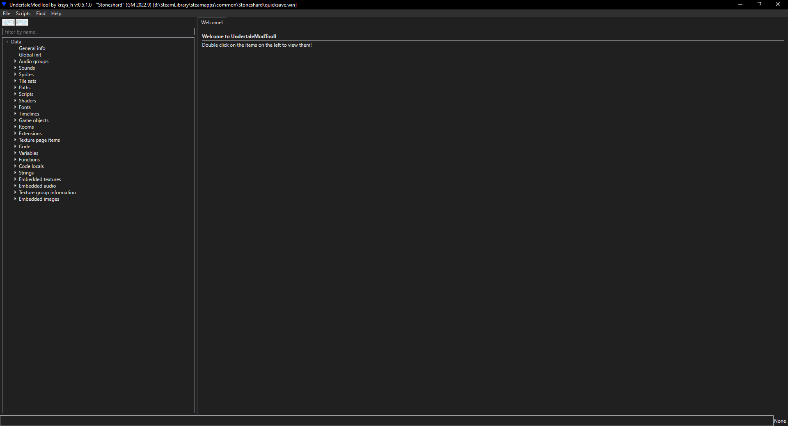
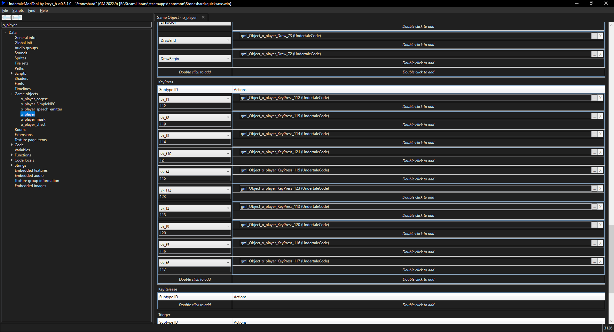

# Getting Started

## Setting up your Environment

In order to make mods for Stoneshard you don't need much.  
There is only a few tools to use and a single file to edit.

However, it's a good idea to stay organized.  
This will help make sure your time is spent working on your mod and not wasted trying to figure out which one of your data.win was the 0.8.0.27 version.

??? abstract "1. Locating your game folder"
    First we're going to find our game folder.  
    Its location differs depending on where you purchased the game :  

    - Steam : `C:\SteamLibrary\steamapps\common\Stoneshard`
    - GOG : `C:\Games\Stoneshard`

    It's a good idea to create a shortcut to this folder, or to pin it so you can access it easily.

??? abstract "2. Backing up the data.win"
    The ==data.win== file is the file containing all of the game's data.  
    This includes everything from sprites to scripts, with some exceptions like sound, dialogs and fonts.

    It's **^^necessary^^** to keep an unmodded (or vanilla) data.win as a backup, mainly for when you need to check vanilla code but also and more importantly for **creating .xdelta patches** later when you want to distribute your mods.

    For now, let's simply rename your data.win to vanilla.win.
    ```
    data.win -> vanilla.win
    ```
    ??? Question "Why renaming instead of making a backup ?"
        The reason why we **rename** the data.win to vanilla.win instead of **making a backup** like data2.win is pretty simple:

        When the game starts, it looks **specifically** for a file called `data.win`.  
        If none is found, it will ^^**open a window to let you select what .win file to load up**^^.

        This is a huge time saver and avoids having to rename your modded file to data.win.  
        It's especially convenient when working on multiple mods at once.

??? abstract "3. Installing the tools"
    Now that we've made a "backup" of our data.win file, it's time to install the **tools** we'll need to mod the game.

    Let's start by creating a **folder** anywhere on your PC.  
    This is the folder where you will keep all your tools.

    Once that is done, check out the **Tools** section of the documentation for a list of tools and their download instructions.  
    The only **required** tools are [UndertaleModTool](../tools/undertalemodtool.md) and [DeltaPatcher](../tools/deltapatcher.md), the rest is only useful for specific scenarios.

    For reference here is my folder structure :

    ```yaml title="B:\Mods\stoneshard-mods\"
    + stoneshard-mods
        - Tools
            - UndertaleModTool
            - DeltaPatcher
            - HGPatcher
            - GML To CSV Converter
        - Art #(1)!
            - ...
        - Archives #(2)!
            - 0.8.1.5
            - 0.8.1.7
            - 0.8.1.8
            - 0.8.1.9
    ```

    1. This is a good place to store all the sprites you may create when modding.

    2. This is a good folder to create to store data.win for **older versions** of Stoneshard.  
    Code is bound to change and being able to access older versions is key.

---

## Creating your First Mod

Now that you've got your tools set up, let's get to work.  
For your first mod we're going to add a quicksave feature to the game when you press the F5 key.

!!! Info
    Yes, this is a fairly basic example, keep in mind that you can mod in way more interesting things in the game, but this guide is written for beginners and as such its aim is to demonstrate the mechanics of making a mod, not how to create content. This is for other guides to cover.

??? abstract "1. Creating and opening your modded .win file"
    Let's head back to your **game folder**.

    In here, we're going to make a **copy** of `vanilla.win`.     
    You can call it whatever you want, I'll call mine `quicksave.win`.

    Once that's done, let's open `quicksave.win` with UMT by double clicking it.

    ---

    

    ---

    Let's do a quick tour of the interface.

    - On the top left, you have a search bar. As expected you can use it to search the game's files.  
    This search bar only works for finding files by names, not searching for content inside of files.

    - Below this you will find the explorer, which lists all the files contained in the .win file.
    Files are placed in different "Blocks", based on what they are. The blocks you will use the most are the `Sprites`, `Game objects` and `Code`.

    - Finally in the right pane is where the content of the files you open will be shown.

??? abstract "2. Adding the Script"
    Pressing the F5 key is an action the player is going to do, so it would make sense to attach the script we're going to write to the player's character.

    - Let's start by searching for `o_player` in the **search bar**.  
    - In the `Game objects` block, you should find `o_player` now.  
    - Double click on it to open it in the right pane.
    - Scroll down to the `KeyPress` Event.

    

    Next to `vk_f5` is the script we want to edit, as this is the one that gets run when the player presses the ++f5++ key.

    - Double click on `gml_Object_o_player_KeyPress_116`. This should open an empty code editor.
    - Let's add the following code to it :  
    ```
    scr_smoothAutoSave()
    scr_actionsLogUpdate("Game Saved !")
    ```

    - Save your **quicksave.win**. ( ++ctrl+s++ or `File > Save` at the top left of your screen)

??? abstract "3. Testing your mod"
    You've added your script, great ! But how do we know if our code works ? Testing !

    So let's get to it. Thankfully, this mod is pretty simple and testing it should take no time at all.

    - Start the game, it should prompt your for which **.win** file to use, select `quicksave.win`.
    - Once in game, load up into any of your saves, and hit the ++f5++ key.
    - The stoneshard logo should appear on the bottom right, and `"Game Saved !"` should appear in the Action Log on your left.

    !!! Warning "Not working ?"
        If something went wrong or this doesn't work, make sure to check the previous sections for mistakes.  
        If it still doesn't work, feel free to message any of the [maintainers](../index.md#contributors) on [Discord :fontawesome-brands-discord:](https://discord.gg/YxfRKYUuht) about it.
    

## Distributing your mod

Our mod works and now we want to share it with other people.  
Sharing your **data.win** would technically work, but could be considered **piracy** since you're essentially sharing game files.

Instead, we're going to use **DeltaPatcher** to create an **.xdelta** file that we can share online.  
Don't worry, this may sound complex but it's completely trivial.

??? abstract "Creating an .xdelta file"
    Read the "**Creating Mods**" section on the **DeltaPatcher** article.

    [See guide here.](../tools/deltapatcher.md#creating-mods)