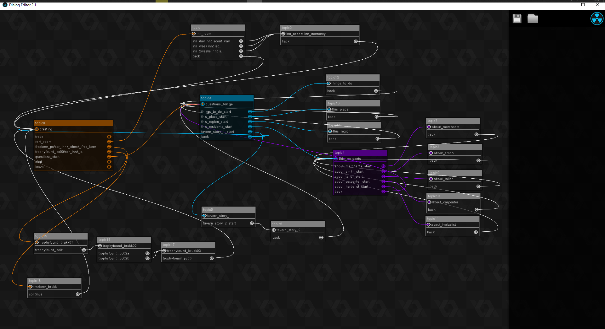

# Dialogue Editor 2

## Description

An essential part of any **dialogue** is its **structure** : which **line** is shown and what **choices** it leads to.  

In Stoneshard, though **individual lines** are stored in the **data.win** file, the overarching **dialogue structure** is not.  
Instead, these are stored in **.de2 files** located in the `dialogs` folder.

These are made with the **Dialogue Editor 2** extension for **Gamemaker Studio 1.4**.  
Thankfully, there is a **program** we can use to read, edit or create our own **dialogues**.

---

## Download

You can grab the **Dialogue Editor 2** extension (which includes the program) from the [Stoneshard Mod Hub :fontawesome-brands-discord:](https://discord.gg/YxfRKYUuht) or below.

[Dialogue Editor 2 :octicons-download-16:](../downloads/DialogEditor2.0.zip){ .md-button .md-button--primary}

---

## Usage

!!! info "WIP"
    Come back later !

---

## Relevant Guides

!!! info "WIP"
    Come back later !

---

## Screenshots

